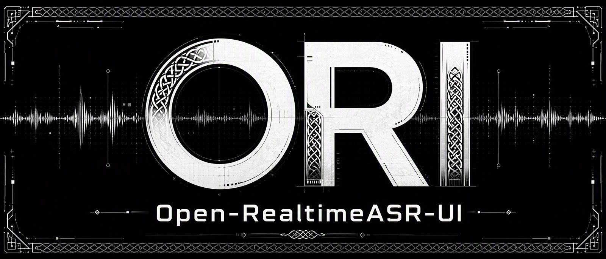

<p align="center">
  
</p>

<div align="center">

# Open-RealtimeASR-UI (ORI)

</div>

<div align="center">


</div>

<div align="center">

[简体中文](README.md) | **English**

</div>

***

<div align="center">
  
</div>

## About

**Open-RealtimeASR-UI (ORI) is a real-time speech-to-text dictation tool for Windows**: press a global hotkey, start talking, and your words appear at the cursor in real time — in any text field, games included. It is an open-source alternative to Windows built-in Voice Typing (Win+H).

Its core design is **no engine lock-in, dictation behavior is yours to define**: four high-accuracy real-time streaming cloud recognition engines, plus the offline local FunASR engine (Paraformer-zh-streaming) — switch them and the text injection method freely from the right-click menu. Around the dictation pipeline it offers AI features, voice commands and AI real-time voice conversation, each toggleable on demand.

> Headphones are recommended to keep speaker echo from interfering with recognition. For the complete guide see the [User Manual](docs/User_Doc_en.md).

 

## Quick Start

### Requirements

- Windows 10 / 11
- Packaged build (`ORI.exe`): double-click to run, no environment needed
- Source build: Python 3.10+

### Run in Three Steps

```bash
# 1. Clone the repo
git clone <repo-url>
cd <repo-dir>

# 2. Install dependencies
pip install -r requirements.txt

# 3. Launch
python run.py
# or: python -m asr_voice.main (ModuleNotFoundError on isolated Python with _pth — fall back to run.py)
# double-click start.bat to have it pick a usable Python automatically
```

### First-Run Setup

1. The first launch auto-generates `config.yaml` (packaged build: next to the exe; source build: under `config/`)
2. The default engine is Alibaba Cloud Model Studio: enter at least one cloud provider's key under Settings → Engine Keys **(every provider offers a free trial quota)**, or right-click and switch to the local FunASR engine (install funasr first, see below)
3. Focus any text field, press `Ctrl+G` and speak; press again to stop and the text is typed automatically

For the full first-run walkthrough see Chapter 3 of the [User Manual](docs/User_Doc_en.md); for every configuration field with comments see [config/config.example.yaml](config/config.example.yaml).

## Speech Engines

### Cloud Engines

Four cloud engines plus one local engine, grouped by tier in the right-click menu (Tencent Cloud 3 tiers / Alibaba Cloud 2 / iFLYTEK 2 / Volcengine 2). The model bound to each tier and its visibility can be adjusted in Settings:

| Engine | Model / version | Keys | Notes |
| :-- | :-- | :-- | :-- |
| Alibaba Cloud Model Studio (default) | General engine `paraformer-realtime-v2`; LLM edition `qwen-audio-3.0-asr-flash-streaming` | `api_key` | Filler-word filtering, hotword lists, language hints |
| Tencent Cloud | Three configurable tiers: LLM 2.0 (default `16k_zh_en_2.0`) / LLM 1.0 (`16k_zh_en`) / general engine (`16k_zh`); direct call defaults to `Hy-ASR-3.0-preview` | `secret_id` + `secret_key` + `app_id` | The model each tier actually calls can be changed in Settings; supports punctuation / digit / profanity / filler-word filtering |
| iFLYTEK | LLM edition `autodialect` (Mandarin + English + 202 dialects); Standard edition Chinese / English | LLM edition: `app_id`+`api_key`+`api_secret`; Standard: `std_app_id`+`std_api_key` | The two editions use separate keys that are not interchangeable |
| Volcengine | Doubao 2.0 (`seedasr`) / 1.0 (`bigasr`); the two generations are billed and configured independently | New: `api_key`; legacy: `app_id`+`access_token` | Two-pass recognition + semantic smoothing (DDC) |
| Local FunASR | `paraformer-zh-streaming` | **No key needed** | Fully offline and free; runs on CPU or GPU |

> Cloud engines must be activated at your own expense in each provider's console (all offer free trial quotas); local FunASR is completely free and offline.
>
> **The packaged build (exe) currently does not include the local FunASR engine**: funasr + torch are too large to bundle, so selecting FunASR prompts you to use a cloud engine or run from source.
>
> Per-engine parameter configuration: see Chapter 6 of the [User Manual](docs/User_Doc_en.md).

### Local Engine: FunASR

```bash
# CPU
pip install funasr torch torchaudio

# GPU (CUDA 11.8 example)
pip install torch torchaudio --index-url https://download.pytorch.org/whl/cu118
pip install funasr
```

- Model weights are neither bundled nor distributed in this repo: they download automatically from ModelScope on first use (~900 MB, cached in `~/.cache/modelscope/`). You can also point `funasr.local_dir` at a model directory you downloaded yourself; the download channel `funasr.model_hub` can be `ms` (ModelScope) or `hf` (HuggingFace)
- The model warms up in the background at launch and the floating bar notifies you when it is ready; recognition window options: default 600 ms / low-latency 480 ms / high-accuracy 720 ms
- The local engine is available in the source build only (the packaged exe excludes funasr + torch); for offline use, download the model in advance

Details: [User Manual](docs/User_Doc_en.md) §3.3.

## Voice Mode

Beyond dictation, press `Ctrl+Shift+H` to enter end-to-end voice conversation (Settings → Voice Mode):

| Backend | Config value | Notes |
| --- | --- | --- |
| Doubao S2S (default) | `doubao` | Volcengine end-to-end speech model: recognition, understanding and spoken replies in one. Two model tiers — O2.0 general chat / SC2.0 role-play — 7 official voices, and you can barge in at any time while the AI is speaking |
| Alibaba Cloud Model Studio Qwen-Audio | `aliyun` | Qwen-Audio Realtime end-to-end speech model: plus / flash tiers, 5 official voices, web search support |
| Hermes Agent (self-hosted) | `hermes` | Self-hosted hermes-agent API server: text-only replies; segmentation and recognition happen on your machine (dedicated dialog ASR); press the hotkey while it is thinking to cancel the current turn; no billing |

Conversation behavior:

- **Enter / exit**: press the dialog hotkey, or tick "Voice chat" in the right-click menu; saying "exit / goodbye" to the AI also ends it
- **Interruption**: Doubao / Qwen are full-duplex by default — just start talking while the AI speaks to interrupt it; Hermes is turn-based (always half-duplex)
- **Memory**: Doubao supports cross-session memory (resumes the last 20 turns); Qwen remembers within a single session; the Hermes server remembers per session
- **Billing**: Doubao / Qwen are billed by each provider's rules; Hermes is self-hosted for your own use, with no billing

Provider keys, models, personas and behavior differences: see Chapter 9 of the [User Manual](docs/User_Doc_en.md).

## Documentation

- **[User Manual](docs/User_Doc_en.md)**: the complete guide — installation and first-run setup, UI overview, engine configuration, AI correction, voice commands, real-time voice conversation, settings pages, configuration fields, FAQ and troubleshooting

- **[Config template](config/config.example.yaml)**: every configuration field with comments; the config file lookup order and a quick reference of common fields are in Chapter 12 of the User Manual

- **[Contributing guide](CONTRIBUTING.md)**: development environment, code structure conventions and commit guidelines

- **[Third-party notices](THIRD_PARTY_NOTICES.md)**: full list of third-party components, copyright attributions and commercial compliance notes

## Project Layout

```
asr_voice/
├── asr/            # ASR engine wrappers + voice dialog
├── audio/          # mic capture, VAD, dialog playback, pause-media / global-mute while recording
├── config/         # config defaults and loading
├── core/           # main app, recognition pipeline, dialog controller, voice commands, history, autostart, elevation, pre-recording noise-floor calibration
├── input/          # text injection
├── postprocess/    # AI correction
└── ui/             # floating bar, settings UI, theme system, fonts
config/             # config template config.example.yaml
themes/             # extension theme pack library
fonts/              # bundled fonts (local/channel builds only, not in the public repo; falls back to system fonts when absent)
docs/               # documentation
```

## Downloads

- **Source**: clone this repo and follow the [Quick Start](#quick-start); local FunASR models are downloaded by the user

- **Packaged build (zip)**: see Releases. Download, extract to any directory, and double-click `ORI.exe` inside to run. **Releases are not yet code-signed** (SignPath integration in progress; CI signs automatically once its credentials are configured): Windows SmartScreen or antivirus software may flag it — PyInstaller packaging combined with global-hotkey and text-injection behavior easily triggers heuristic false positives. You can verify the zip against the `SHA256SUMS.txt` release asset (`certutil -hashfile ORI-<version>-win64.zip SHA256`), or run from source instead

## Privacy

- Cloud recognition engines: recorded audio and recognition results are sent to the cloud provider you configured (Alibaba Cloud / Tencent Cloud / iFLYTEK / Volcengine); please review each provider's privacy policy yourself

- Local FunASR engine: audio and recognition stay entirely on your machine; nothing is uploaded

## Code signing policy

Windows builds published on GitHub Releases are code signed using a free certificate from the open-source community:

> Free code signing provided by [SignPath.io](https://about.signpath.io), certificate by [SignPath Foundation](https://signpath.org)

Signing roles (a solo project — all three roles are the same person):

- Authors / Reviewers / Approvers: [@LangeHeris](https://github.com/LangeHeris)

Privacy policy: [docs/PRIVACY_POLICY.md](docs/PRIVACY_POLICY.md)

> Note: until the SignPath review completes, releases remain **unsigned** (verify them against the bundled `SHA256SUMS.txt`, see [Downloads](#downloads)).
